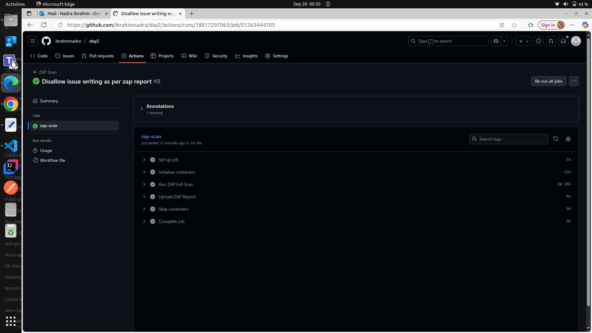
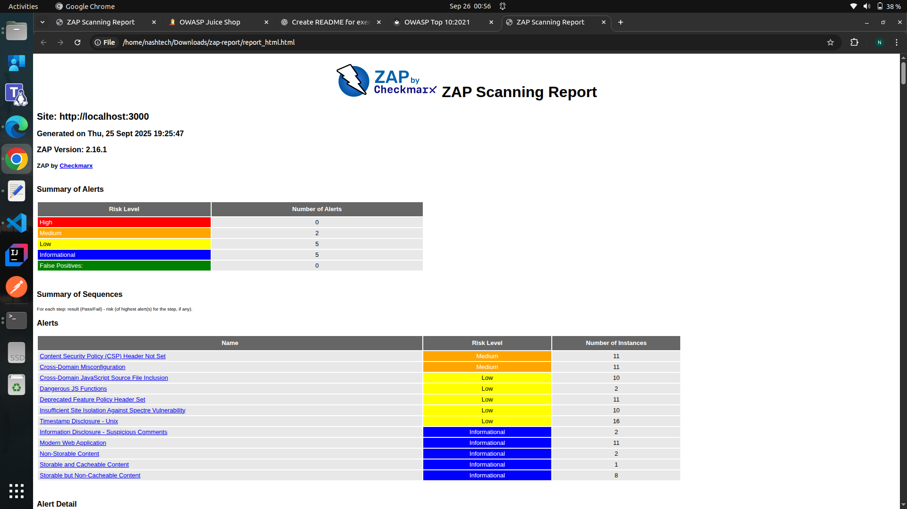
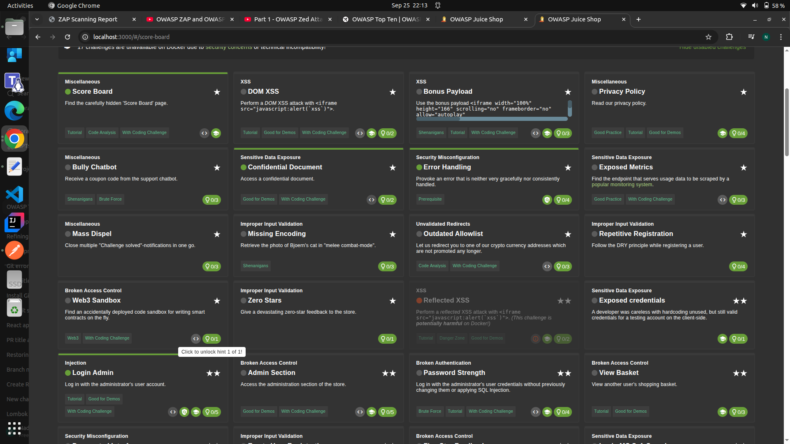
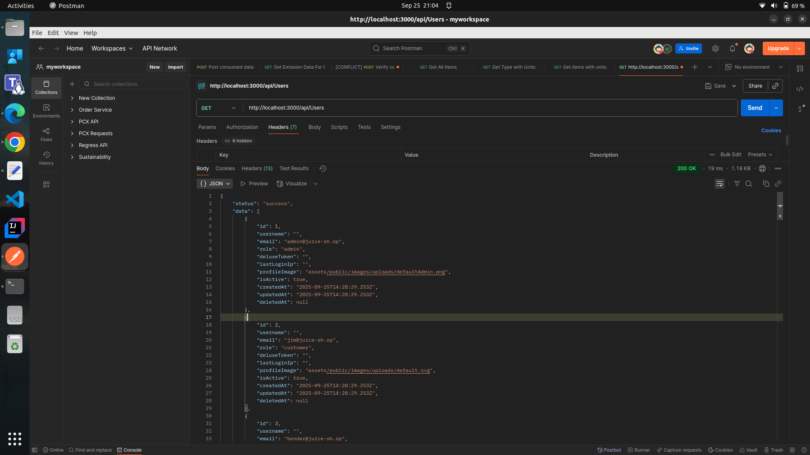
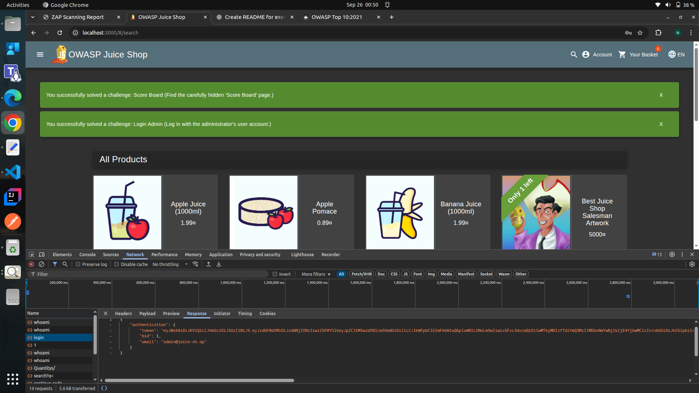

# Exercise for Day 2: OWASP Top 10 – Overview & Use Cases

## Objective
Enable attendees to practice **Dynamic Application Security Testing (DAST)** using **OWASP ZAP**, identify common web vulnerabilities, and understand their impact and mitigation.

---

## Tasks

### 1. **Added a Github Action pipeline**  
   - The pipeline included:
     - A service to start the OWASP Juice Shop application in a Docker container.
     - A job to run an OWASP ZAP scan against the running application. (can use the docker image for that as well)
     - A job to generate and store the scan report as an artifact.
   
   
### 2. **Analyze the report**  
   - Identified two vulnerabilities from the report:
     - **A02:2021 – Cryptographic Failures**
     - **A03:2021 – Injection**
    

### 3. Exploited the vulnerabilities manually using a web browser or tools like Postman. (for better understanding)
   - Screenshots of the exploited vulnerabilities:
   
   
   - **A02:2021 – Cryptographic Failures**
      - Logged in as a common user and get the Authorization token from the browser developer tools.
      - API call to get the list of registered users using Postman with this Authorization token and got the sensitive data.
      
   
   - **A03:2021 – Injection**
      - In the email field of the login page, entered `' OR true--`
      - In the password field, entered any random value.
      - Successfully logged in as the admin user.
      

### 4. **Impact and Suggested Fixes for the Vulnerabilities**  
   - **A02:2021 – Cryptographic Failures**
      - **Impact:** Exposure of sensitive data, unauthorized access to users' information.
      - **Suggested Fixes:** Implement proper access controls, use secure tokens, and ensure sensitive data is encrypted both in transit and at rest.
   
   - **A03:2021 – Injection**
      - **Impact:** Unauthorized access to the application, potential data breaches, and manipulation of application behavior.
      - **Suggested Fixes:** Use parameterized queries or ORM to prevent SQL injection, validate and sanitize all user inputs, and implement proper error handling.

---

### Core Concept Questions

**1. What is the purpose of DAST and how does it complement other security testing methods?**  
DAST (Dynamic Application Security Testing) identifies vulnerabilities in a running application from an external perspective. It complements static testing (SAST) by catching issues visible only during runtime, such as input validation flaws or authentication bypasses.

**2. Explain how XSS or SQL injection vulnerabilities can affect an application and its users.**  
- **XSS (Cross-Site Scripting):** Allows attackers to execute malicious scripts in users’ browsers, potentially stealing cookies, session tokens, or defacing the site.  
- **SQL Injection:** Enables attackers to manipulate database queries, exposing sensitive data, bypassing authentication, or corrupting data.

**3. Describe the steps you would take to fix the vulnerabilities detected in your ZAP scan.**  
- For **Cryptographic Failures**, implement strong access controls, use secure tokens, and ensure encryption of sensitive data.  
- For **Injection**, use parameterized queries, validate and sanitize all user inputs, and implement proper error handling.

**4. How does integrating ZAP scans into CI/CD pipelines support shift-left security practices?**  
Automating ZAP scans in CI/CD ensures security checks run early in development. This **shift-left approach** detects vulnerabilities before deployment, reducing cost, risk, and remediation time.

---
